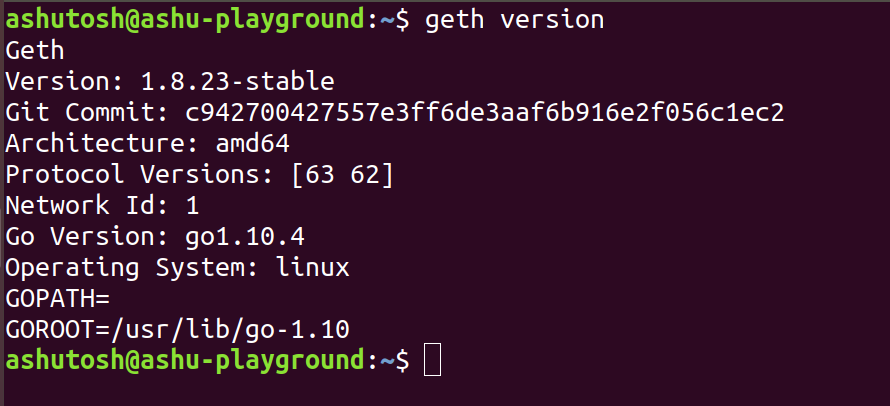
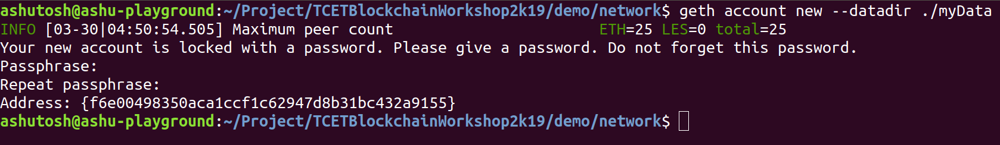
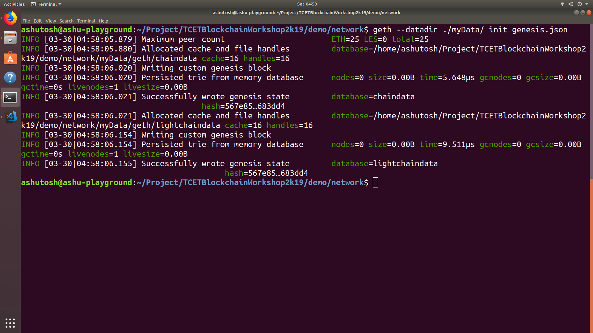

Getting Started with Geth
==========================

.. code-block:: bash

    sudo apt-get install software-properties-common
    sudo add-apt-repository -y ppa:ethereum/ethereum
    sudo apt-get update
    sudo apt-get install ethereum

.. code-block:: bash

    geth version

.. code-block:: bash
    
    geth account new --datadir ./myData

*gensis.json*
-------------
.. code-block:: json
    
    {
    "config": {
        "chainId": 15,
        "homesteadBlock": 0,
        "eip155Block": 0,
        "eip158Block": 0
    },
    "difficulty": "0x1",
    "gasLimit": "8000000",
    "alloc": {
    "f6e00498350aca1ccf1c62947d8b31bc432a9155" : {
    "balance": "888888888888888888888888" }
    }

.. warning::

    Please use the address which is generated
    insted of **f6e00498350aca1ccf1c62947d8b31bc432a9155**

.. code-block:: bash

    geth --datadir ./myData init genesis.json

