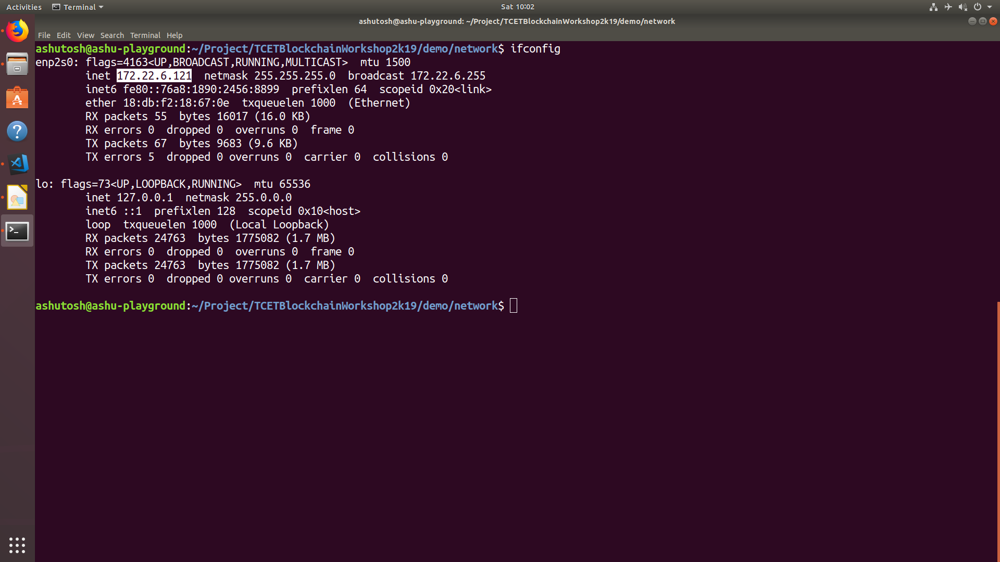
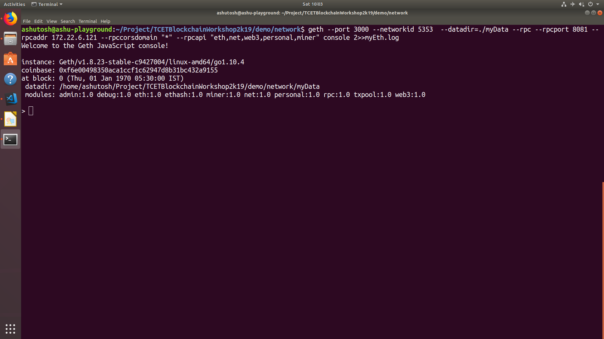
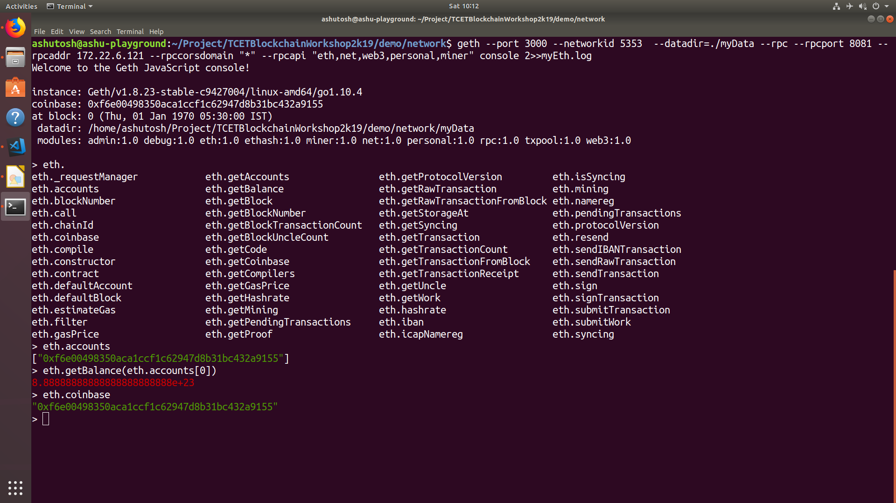
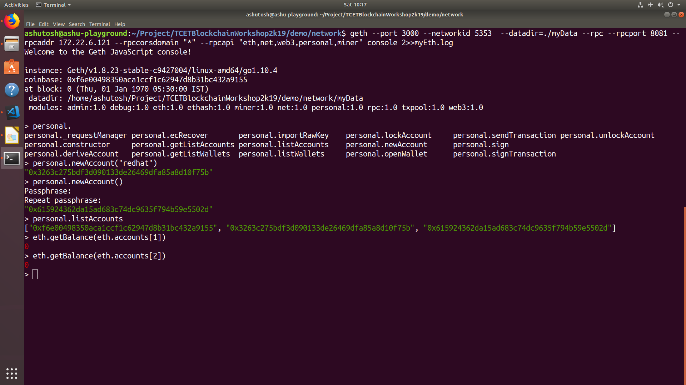
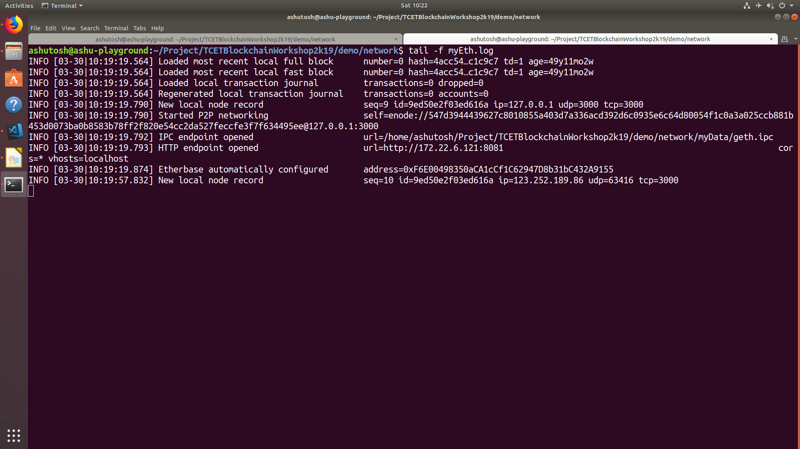
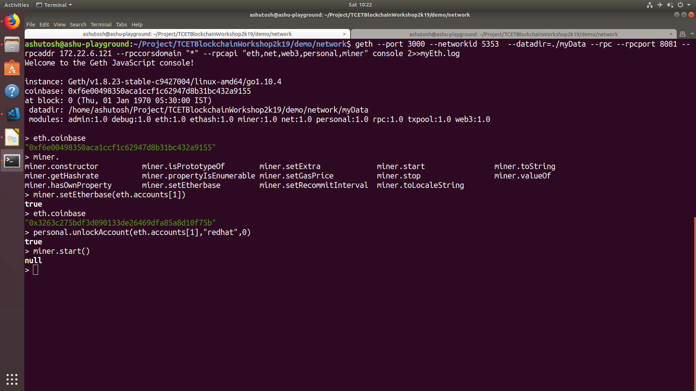
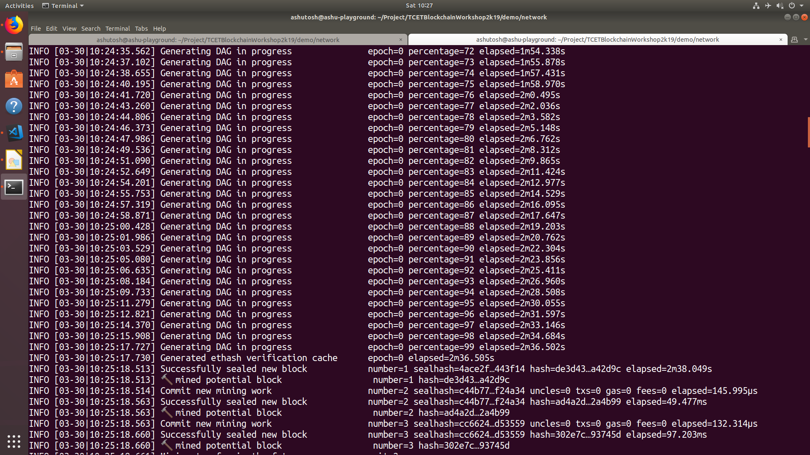
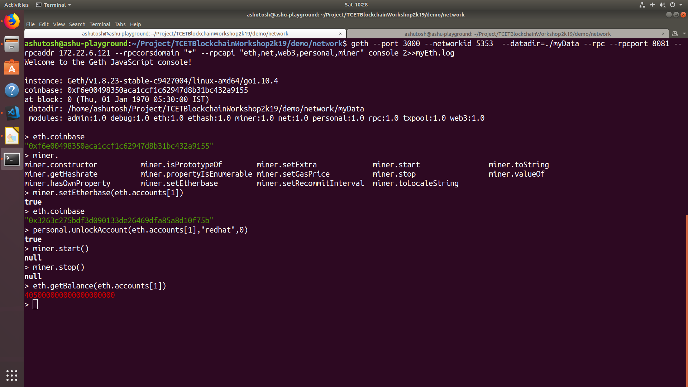
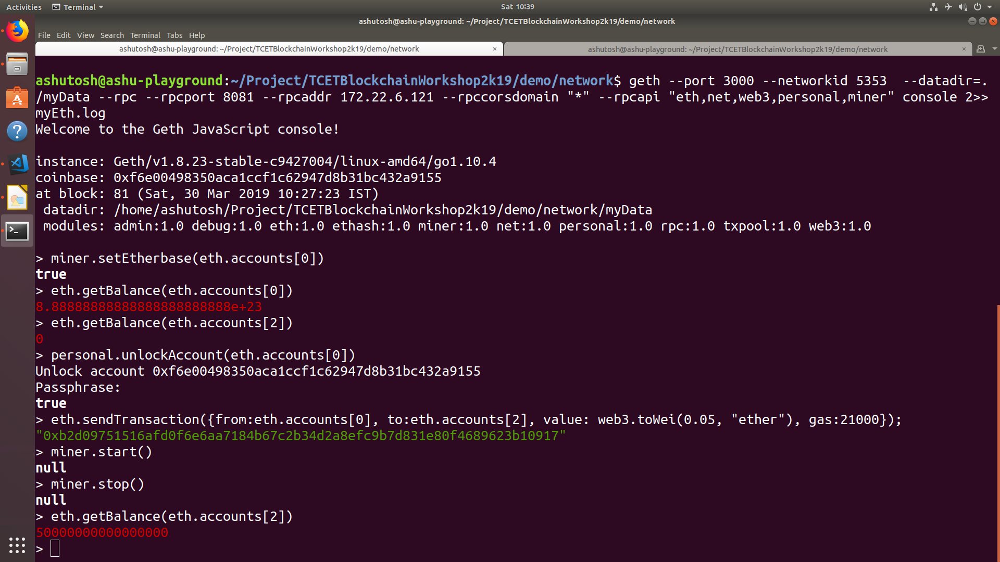

Getting Started with Geth
==========================

.. code-block:: bash

    sudo apt-get install software-properties-common
    sudo add-apt-repository -y ppa:ethereum/ethereum
    sudo apt-get update
    sudo apt-get install ethereum

.. code-block:: bash

    geth version

.. image:: screenshots/01_geth_v.png

.. code-block:: bash
    
    geth account new --datadir ./myData

.. image:: screenshots/02_creating_admin_account.png

*gensis.json*
-------------
.. code-block:: json
    
    {
    "config": {
        "chainId": 15,
        "homesteadBlock": 0,
        "eip155Block": 0,
        "eip158Block": 0
    },
    "difficulty": "0x1",
    "gasLimit": "8000000",
    "alloc": {
    "f6e00498350aca1ccf1c62947d8b31bc432a9155" : {
    "balance": "888888888888888888888888" }
    }

.. warning::

    Please use the address which is generated
    instead of **f6e00498350aca1ccf1c62947d8b31bc432a9155**

.. code-block:: bash

    geth --datadir ./myData init genesis.json

.. image:: screenshots/03_geth_init.png

.. code-block:: bash

    ifconfig

.. code-block:: bash

    geth --port 3000 --networkid 5353  --datadir=./myData --rpc --rpcport 8081 --rpcaddr 172.22.6.121 --rpccorsdomain "*" --rpcapi "eth,net,web3,personal,miner" console 2>>myEth.log

.. code-block:: bash

    eth.accounts
    eth.getBalance(eth.accounts[0])
    eth.coinbase

.. code-block:: bash

    personal.newAccount("redhat")
    personal.newAccount()
    eth.getBalance(eth.accounts[1])
    eth.getBalance(eth.accounts[2])

.. code-block:: bash

    tail -f myEth.log

.. code-block:: bash
    
    eth.coinbase
    miner.setEtherbase(eth.accounts[1])
    eth.coinbase
    personal.unlockAccount(eth.accounts[1],"redhat",0)
    miner.start()

.. code-block:: bash

    tail -f myEth.log

.. code-block:: bash

   miner.stop()
   eth.getBalance(eth.accounts[1])

.. code-block:: bash

    miner.setEtherbase(eth.accounts[0])
    eth.getBalance(eth.accounts[0])
    eth.getBalance(eth.accounts[2])
    personal.unlockAccount(eth.accounts[0])
    eth.sendTransaction({from:eth.accounts[0],to:eth.accounts[2],value: web3.toWei(0.05,"ether"),gas:21000});
    miner.start()
    miner.stop()
    eth.getBalance(eth.accounts[2])

