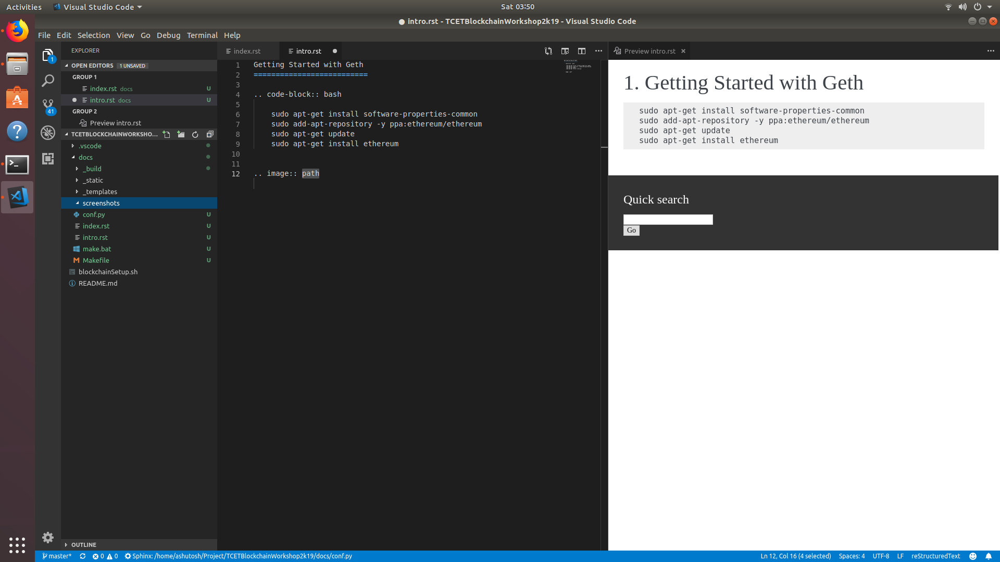

Getting Started with Geth
==========================

.. code-block:: bash

    sudo apt-get install software-properties-common
    sudo add-apt-repository -y ppa:ethereum/ethereum
    sudo apt-get update
    sudo apt-get install ethereum

