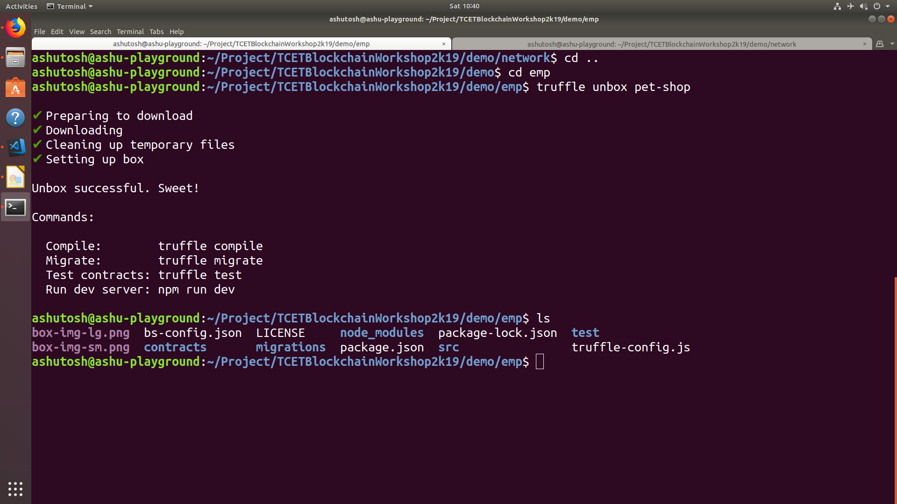
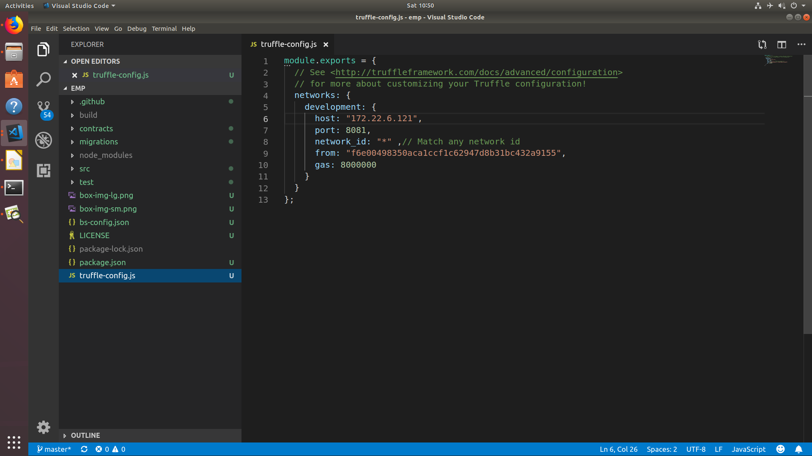

Setup Truffle
=============

.. code-block:: bash
    
    truffle unbox pet-shop
    ls

*EmpAttendance.sol*

.. code-block:: javascript

    module.exports = {
    // See <http://truffleframework.com/docs/advanced/configuration>
    // for more about customizing your Truffle configuration!
    networks: {
        development: {
            host: "172.22.6.121",
            port: 8081,
            network_id: "*" ,// Match any network id
            from: "f6e00498350aca1ccf1c62947d8b31bc432a9155",
            gas: 8000000
                    }
                }
    };

.. code-block:: javascript

    pragma solidity ^0.5.0;
    pragma experimental ABIEncoderV2;

    contract Owned {
        
        address owner;
        
        constructor() public {
            owner = msg.sender;
        }
        
        modifier onlyOwner {
            require (msg.sender == owner);
            _;
        }
    }

    contract EmpAttendance is Owned {
        
        struct employee {
            string empName;
            string empDepartment;
            string [] empAttendance;
        }
        
        mapping (address => employee) db_empAttendanceRecord;
        address [] db_empAccounts;
        
        function signUp(string memory _empName , string memory _empDeparment) public {
            
            employee memory newEmployee = employee(_empName,_empDeparment,new string);
        
            db_empAttendanceRecord[msg.sender] = newEmployee;
            db_empAccounts.push(msg.sender);
        }
        
        function markAttendance(string memory _date) public {
            db_empAttendanceRecord[msg.sender].empAttendance.push(_date);
        }
        
        function viewAttendance() public returns (string [] memory) {
            return db_empAttendanceRecord[msg.sender].empAttendance;
        }
        
        function viewEmpAttendance(address _empaddress) onlyOwner public returns (string [] memory)
        {
            return db_empAttendanceRecord[_empaddress].empAttendance;
        }
        
        function viewEmpName(address _empaddress) onlyOwner public returns (string memory)
        {
            return db_empAttendanceRecord[_empaddress].empName;
        }
        
        function viewEmpAccounts() onlyOwner public returns (address [] memory)
        {
            return db_empAccounts;
        }
    }
